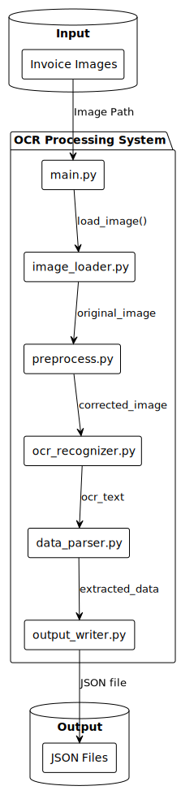

# Test OCR for Doc1

TesseractとOpenCVを使用した帳票OCRシステムの実装です。AIを使わず、オープンソース技術のみで帳票画像からテキスト抽出とフィールド分割を行います。

## 考え方・設計指針

このテストは、クラウドや有料サービスに依存しないローカル完結のOCRパイプラインを検証し、帳票から抽出した情報をJSONとして出力することを目的とします。

設計上の狙いは以下です。

- 処理を説明可能にしてデバッグしやすくする（前処理後の画像、OCRの生テキスト、正規表現抽出結果などを追える）
- 機械学習ではなく、単純で決定論的なルール（画像処理 + 正規表現）を優先する
- 帳票レイアウト差分に対して、前処理設定や正規表現パターンを差し替えやすくする

現在の処理パイプラインは以下です。

1. **画像読み込み** (`image_loader.py`)
2. **前処理・傾き補正** (`preprocess.py`) 
3. **OCR文字認識** (`ocr_recognizer.py`)
4. **フィールド分割・JSON出力** (`data_parser.py`, `output_writer.py`)

## モジュール概要

### システム構成図



### 処理フロー図


### 各モジュール

### A. 画像読み込みモジュール (`image_loader.py`)
- 帳票画像ファイルの読み込み
- 対応フォーマット: PNG, JPG, TIFF等

### B. 前処理モジュール (`preprocess.py`)
- OpenCVを使用した画像前処理
- 傾き補正（スキュー補正）
- ノイズ除去・コントラスト調整
- 輪郭検出による文書領域抽出

### C. OCR認識モジュール (`ocr_recognizer.py`) 
- Tesseractエンジンによる日本語OCR
- 文字認識精度の最適化
- 縦書き・横書き混在対応

### D. データ解析モジュール (`data_parser.py`)
- 正規表現によるフィールド抽出
- 帳票項目の自動分類
- 金額・日付・住所等の構造化

### E. 出力モジュール (`output_writer.py`)
- JSON形式での結果出力
- 抽出データの構造化
- エラーハンドリング

## 依存関係

- Python 3.11
- OpenCV (`opencv-python`)
- Tesseract OCR 
- pytesseract
- NumPy
- Pillow

## セットアップ

### 1. 仮想環境の準備
```bash
# プロジェクトルートで実行
.\ocr_env\Scripts\activate
```

### 2. Tesseractのインストール
1. [Tesseract-OCR for Windows](https://github.com/UB-Mannheim/tesseract/wiki)をダウンロード
2. インストール時に「Japanese (jpn)」言語パックを選択
3. インストールパス（通常 `C:\Program Files\Tesseract-OCR\`）を確認

### 3. パス設定の確認
`ocr_recognizer.py`内のTesseractパスが正しく設定されていることを確認：
```python
pytesseract.pytesseract.tesseract_cmd = r"C:\Program Files\Tesseract-OCR\tesseract.exe"
```

## 実行方法

### 1. 画像の準備
- 帳票画像を`documents/images/`フォルダに配置
- 推奨フォーマット: PNG（300DPI以上）

### 2. メイン処理の実行
```bash
cd test_ocr_for_doc1
python main.py
```

### 3. 実行時の設定
`main.py`の最下部で画像パスを指定：
```python
sample_image_path = os.path.join(os.path.dirname(__file__), 'documents', 'images', 'sample_invoice.png')
main(sample_image_path)
```

## 出力

### 処理ログ例
```
画像を読み込みました: documents/images/sample_invoice.png
傾き補正処理を完了しました。
OCR文字認識を完了しました。
OCR認識結果の一部:
請求書
株式会社〇〇〇
請求日：2024年12月20日...

正規表現によるフィールド分割を完了しました。
フィールド分割結果の一部:
{
  "document_type": "請求書",
  "company_name": "株式会社〇〇〇",
  "date": "2024年12月20日",
  ...
}

JSONファイルを生成しました: documents/images/sample_invoice.json
```

### JSON出力例
```json
{
  "document_type": "請求書",
  "company_name": "株式会社〇〇〇", 
  "invoice_date": "2024年12月20日",
  "amount": "100,000",
  "items": [
    {
      "description": "商品A",
      "quantity": "10",
      "unit_price": "5,000"
    }
  ],
  "extracted_raw_text": "請求書\n株式会社〇〇〇\n..."
}
```


## 制限事項

- 帳票レイアウトが大きく異なる場合は正規表現パターンの調整が必要
- 手書き文字の認識精度は限定的
- 複雑な表構造の解析は追加実装が必要