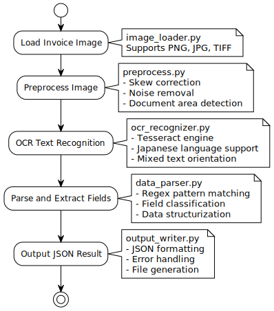

# Test OCR for Doc1

TesseractとOpenCVを使用した帳票OCRシステムの実装です。AIを使わず、オープンソース技術のみで帳票画像からテキスト抽出とフィールド分割を行います。

## 設計指針

このテストは、クラウドや有料サービスに依存しないローカル完結のOCRパイプラインを検証し、帳票から抽出した情報をJSONとして出力することを目的とします。

設計上の狙いは以下です。

- 処理を説明可能にしてデバッグしやすくする（前処理後の画像、OCRの生テキスト、正規表現抽出結果などを追える）
- end2endの機械学習ではなく、単純で決定論的なルール（画像処理 + 正規表現）を優先する
  - **機械学習技術は用いています**
- 所与の帳票レイアウトに対して、前処理設定や正規表現パターンを手動で与える

以下の流れで上から順番に処理します．

1. **画像読み込み** (`lib/image_loader.py`)
2. **前処理・傾き補正** (`lib/preprocess.py`) 
3. **OCR文字認識** (`lib/ocr_recognizer.py`)
4. **フィールド分割・JSON出力** (`lib/data_parser.py`, `lib/output_writer.py`)

## モジュール構成

本テストでは、モジュールを`lib/`ディレクトリに配置し、メイン実行ファイル(`main.py`)から読み込む構成としています。

```
test_ocr_for_doc1/
├── main.py                 # メイン実行ファイル
├── lib/                    # ライブラリモジュール
│   ├── image_loader.py     # 画像読み込み
│   ├── preprocess.py       # 前処理
│   ├── ocr_recognizer.py   # OCR認識
│   ├── data_parser.py      # データ解析
│   ├── output_writer.py    # 出力
│   └── prepro_test.py      # 前処理テスト
└── documents/              # ドキュメント・画像格納
```

## モジュール概要
**システム構成図**


**処理フロー図**



**各モジュールごとの役割**

- A. 画像読み込みモジュール (`lib/image_loader.py`)
  - 帳票画像ファイルの読み込み
  - 対応フォーマット: PNG, JPG, TIFF等

- B. 前処理モジュール (`lib/preprocess.py`)
  - OpenCVを使用した画像前処理
  - 傾き補正（スキュー補正）
  - ノイズ除去・コントラスト調整
  - 輪郭検出による文書領域抽出

- C. OCR認識モジュール (`lib/ocr_recognizer.py`) 
  - Tesseractエンジンによる日本語OCR
  - 文字認識精度の最適化
  - 縦書き・横書き混在対応

- D. データ解析モジュール (`lib/data_parser.py`)
  - 正規表現によるフィールド抽出
  - 帳票項目の自動分類
  - 金額・日付・住所等の構造化

- E. 出力モジュール (`lib/output_writer.py`)
  - JSON形式での結果出力
  - 抽出データの構造化
  - エラーハンドリング

## 依存関係

- Python 3.11
- OpenCV (`opencv-python`)
- Tesseract OCR 
- pytesseract
- NumPy

## セットアップ
[README.md](../../README.md)のセットアップが完了している前提です．

**仮想環境の準備**
```bash
# プロジェクトルートで実行
.\ocr_env\Scripts\activate
```

**パス設定の確認**
`lib/ocr_recognizer.py`内のTesseractパスが正しく設定されていることを確認：
```python
pytesseract.pytesseract.tesseract_cmd = r"C:\Program Files\Tesseract-OCR\tesseract.exe"
```

## PDFファイルの準備

PDFファイルをPNG画像に変換してOCR処理を行う場合は、プロジェクトルートの変換スクリプトを使用してください：

```bash
# プロジェクトルートに移動
cd ..\..

# PDF→PNG変換スクリプト実行
python util\convert_pdf_to_png.py
```

このスクリプトは以下の機能を提供します：
- PDFファイルの各ページをPNG画像に変換
- 高解像度（300 DPI）でのOCR最適化
- 処理対象ディレクトリの自動検出
- エラーハンドリングと詳細な進捗表示

変換された画像ファイルは`documents/images/test/`ディレクトリに保存され、OCR処理の対象となります。

**テスト実行**
Tesseract OCRの環境が正しくセットアップされているか確認するため、環境テストを実行します。
```bash
cd test_ocr_for_doc1
python lib/ocr_recognizer.py test
```
このコマンドは以下の項目を確認します：
1. pytesseractパッケージのインストール確認
2. Tesseract実行ファイルの存在確認
3. Tesseractバージョンの確認
4. Tesseract APIの呼び出しテスト
5. 日本語言語データ(jpn)のインストール確認
6. OpenCV (cv2)パッケージのインストール確認

※ 正常な出力例
```
============================================================
Tesseract OCR 環境確認
============================================================

[1] pytesseractパッケージの確認...
✓ pytesseractパッケージがインストールされています

[2] Tesseract実行ファイルの確認...
✓ Tesseract実行ファイルが見つかりました
  パス: /opt/homebrew/bin/tesseract

[3] Tesseractバージョンの確認...
✓ tesseract 5.3.3

[4] Tesseract API呼び出しテスト...
✓ Tesseract APIの呼び出しに成功しました

[5] 日本語言語データの確認...
✓ 日本語(jpn)言語データがインストールされています

[6] OpenCV (cv2)パッケージの確認...
✓ OpenCVパッケージがインストールされています
  バージョン: 4.8.1

============================================================
✓ 全ての確認項目をパスしました！
Tesseract OCRを使用する準備ができています。
============================================================
```
次に，
```bash
cd test_ocr_for_doc1
python lib/ocr_recognizer.py
```
以下のような結果が出力されれば成功です．

```
(ocr_env) PS C:\Users\NakanoShiryu\Documents\workspace\ocr_project\test_ocr_for_doc1> python .\lib\ocr_recognizer.py
OCR処理を実行します...
Looking for image at: C:\Users\NakanoShiryu\Documents\workspace\ocr_project\test_ocr_for_doc1\documents\images\sample\sample.png
File exists: True
日本語でOCR処理を実行しました。
Recognized Text:
吾 輝 は 猛 で あ る 。 名 前 は ま だ 無 い 。

ど ご で 生 れ た か と ん と 見 当 が つ か ぬ 。 何 で も 薬 暇 い じ め じ め し た 所 で ニ ャ ー ニ ャ ー 泣 い て
い た 事 だ け は 記 憾 し て い る 。 吾 璽 は こ こ で 始 め て 人 間 と い う も の を 見 た 。 し か も あ と で 聞 く
と そ れ は 書 生 と い う 人 間 中 で 一 番 猛 悪 な 種 族 で あ っ た そ う だ 。 こ の 書 生 と い う の は 時 々 我 々
を 捕 え て 燕 て 食 う と い う 話 で あ る 。 し か し そ の 当 時 は 何 と い う 考 ち な か っ た か ら 別 段 恐 し い
と も 思 わ な か っ た 。 た だ 彼 の 掌 に 載 せ ら れ て ス ー と 持 ち 上 げ ら れ た 時 何 だ か フ ワ フ ワ し た 感

じ が あ っ た だ ば か り で あ る 。 掌 の 上 で 少 し 煙 ち つ い て 書 生 の 顔 を 見 た の が い わ ゆ る 人 間 と い う

も の の 見 始 で あ ろ う 。 ご の 時 妙 な も の だ と 思 っ た 感 じ が タ で も 残 っ て い る 。 第 一 毛 を ち っ て
装 飾 さ れ ぺ べ き は ず の 顔 が つ る つ る し て ま る で 荒 缶 だ 。 そ の 後 猪 に も だ い ぶ 逢 っ た が こ ん な 片
輪 に は 一 度 も 出 会 わ し た 事 が な い 。 の み な ら ず 願 の 真 中 が あ ま り に 突 起 し て い る 。 そ う し て
そ の 穴 の 中 か ら 時 々 ぷ う ぶ う と 煙 を 吹 く 。 ど う も 咽 せ ぽ く て 実 に 弱 っ た 。 こ れ が 人 間 の 飲 む
煙 草 と い う も の で あ る 事 は よ う や く こ の 頃 知 っ た 。


(ocr_env) PS C:\Users\NakanoShiryu\Documents\workspace\ocr_project\test_ocr_for_doc1>
```
ここまでで，実際にTessarct OCRの実行確認が完了です．

